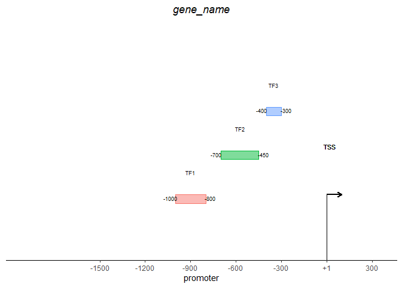

<!-- README.md is generated from README.Rmd. Please edit that file -->

# ggtfplot - to draw TFs based on ggplot2

<!-- badges: start -->
<!-- badges: end -->

The goal of ggtfplot is to create plots of transcription factors on gene
promoters

## Installation

You can install the development version of ggtfplot from
[GitHub](https://github.com/) with:

``` r
# install.packages("devtools")
devtools::install_github("ubogoeva/ggtfplot")
```

## Example

This is a basic example which shows you how to solve a common problem:

``` r
library(ggtfplot)
example_df <- data.frame(
  TF = c("TF1", "TF2", "TF3"),
  rel_beg = c(-1000, -700, -400),
  rel_end = c(-800, -450, -300)
)
draw_TF_plot(example_df, prom_length = 1000, title = "gene_name")
```



You’ll still need to render `README.Rmd` regularly, to keep `README.md`
up-to-date. `devtools::build_readme()` is handy for this. You could also
use GitHub Actions to re-render `README.Rmd` every time you push. An
example workflow can be found here:
<https://github.com/r-lib/actions/tree/v1/examples>.

In that case, don’t forget to commit and push the resulting figure
files, so they display on GitHub and CRAN.
